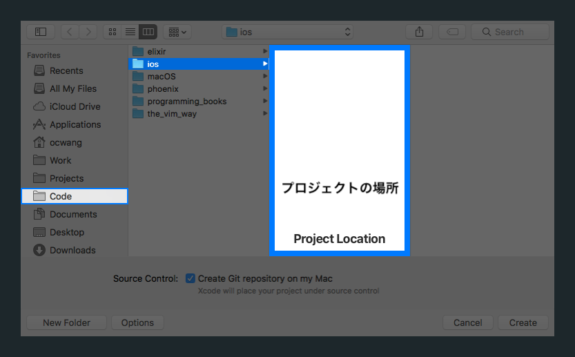

このチュートリアルの大部分ではXcodeについて学んでいきます。このセクションではXcodeを初紹介し、私たちのアプリのための新しいXcodeプロジェクトを作成する手順をこなしていきます。

## Xcodeとは何ですか？

Xcodeとは、 Appleのエコシステム内でアプリを開発する_統合開発環（Integrated Development Environment）_（IDE）です。iOS アプリに焦点を当てますがmacOS、watchOS、tvOS のアプリのためにもアプリを作成することができます。IDE（Xcodeなど）には、プログラマーのソフトウェア開発を簡単にしてくれる強力なツールがたくさん含まれ、統合されています。

Xcodeでのアプリ開発について学ぶ際には、これらのツールの多くを使うことになります。日常的によく使うツールには、次のものが含まれるかもしれません：

- **ソースコードエディタ：** コードを書いて編集します
- **インターフェースビルダー：** コードを書かずにユーザーインターフェース（UI）を開発し、可視化させます
- **デバッガー：** コードの問題をテスト、発見、デバッグします
- **コンパイラ：** コード内の間違いを発見する補助をし、「Fix-it」という修正提案を表示します
- **アシスタントエディタ：** Xcodeの複数のファイルを隣り合わせに並べて編集します
- **シミュレーター：** コンピューターでシミュレートされたiPhone上でアプリをテストし、実行します

Magic 8-Ballの開発を進めていく中で、これらのツールのそれぞれについて深く学んでいきます。

> [info]
Xcodeには上記のツール以外にもまだまだたくさんツールが含まれていることを覚えておきましょう。このチュートリアルではシンプルなiOSアプリを開発するにあたって最も重要となるXcodeのツールだけを学ぶように焦点を絞ります。

# 初めての Xcode プロジェクト

初体験というのは何であっても特別なものです。Xcodeについて少し学んだところで、_初の_Xcodeプロジェクトの作成を始めましょう。

このプロセスに慣れましょう！ 新たなアプリを開始する度に、何度も何度も繰り返すことになります。

> [action]
新しい Xcode プロジェクトの作成：
>
1. コンピューター上で _Xcode_ を開きます。You should see the following launch window after you open Xcode 
1. 次に、起動ウィンドウのクイックオプションから `Create a new Xcode project`をクリックしてください！[Create New Project](assets/create_new_project.png)
1. 新しいプロジェクトのテンプレートを選択するように促す次のようなプロンプトが表示されるはずです。Under _iOS_, select _Single View App_ 
1. テンプレートを選択した状態で、 _Next_ をクリックしてください。You should see a new prompt for your project details 

この新しいプロンプトでは、新しいプロジェクトを作成するためにXcodeが必要とする基本情報や詳細を設定します。

> [action]
プロジェクトの詳細に関するプロンプトでは、以下の情報を入力してください：
>

>
ステップバイステップの分析が必要な場合は：
>
1. _Product Name_ フィールドに、`MagicEightBall`と入力してください。これがファイルディレクトリにおけるあなたのプロジェクトの名前になります。名前に関する潜在的な問題を防ぐため、英数字（文字と数字）を使い、特殊文字を避けるのが一番です。
1._Team_のドロップダウンメニューは、`None`に設定してください。`Apple Developer Team`がすでにある場合は、これを代わりにを選択することもできます。
1. _Organization Name_ には、次のいずれかを入力できます。自分の名前、仮の会社名、または _Make School_ です。
1. _Organization Identifier_ は、 _com.makeschool_ と設定してください。ドメイン名を持っている場合は、このフィールドをリバースドメイン名として設定することができます。例えば、 _happycarrot.com_ というドメイン名を持っている場合は、識別子として _com.happycarrot_ と入力することになります。
1. _Bundle Identifier_ は、あなたの _Organization Identifier_ と _Product Name_ から自動的に生成されます。AppleはバンドルIDを使用して、 _App Store_ で各アプリを一意的に特定します。
1. _Language_ のドロップダウンメニューが、`Swift`に設定されているようにしてください。
1. 最後に、3つのチェックボックスすべてからチェックを外してください。このチュートリアルでは、 _Core Data_ もいずれのテストも使いません。これらはより上級の話題です。別の機会に紹介します。

<!-- break -->

> [action]
作業を完了して、新しいプロジェクトを作成するには：
>
1. 上のプロジェクト詳細を記入したら、 _Next_ をクリックしてください。
1. Xcodeは次に、どこへプロジェクトを保存したいかたずねます。ファイルナビゲーターを使って、コンピューター上でプロジェクトを保存したい場所を選択してください。特定の場所が思いつかない場合は、`Documents`フォルダを使用することができます。
1. _Create Git repository on my Mac(Git保管庫をマイマックに作成する)_ の時は必ずソースコントロールチェックボックスが選択された状態にしていてください。
1. プロジェクトの位置を選択し、 _Source Control_ チェックボックスが選択された状態であることを確認した後で、`Create`ボタンをクリックしてください。

おめでとうございます！ あなたの初のプロジェクトができました。次のように表示されます。

ワクワクしませんか？ これは何か特別なことの始まりだと思います。

# Xcodeについて知る

Magic 8-Ballアプリの開発を通じて、Xcodeについて、そしてその能力を活用する方法について学んでいきます。次のセクションに移る前に、 Xcodeの主な部分をそれぞれ簡単に紹介していきます。また、新しく作成したアプリをシミュレーター上で実行する方法についても紹介しましょう。

以前に終了した場所から再開すると、次のような状態になるはずです。

すごい！ 一目見ただけで、いろいろなことが起こっているのがわかります。タブ、ボタン、パネル、テキストフィールドがいたるところにありますね！

びっくりしてしまったら、深呼吸しましょう。一緒にこの道を歩んでいきましょう。

## Xcode の主要なエリア

Xcodeは主に4つのエリアと、ツールバー1つから成り立っています。

次に上記の各エリアを簡単に分解してみました：

1. **ツールバー（緑）：** プロジェクトに関する主要な情報を表示し、他のエリアを拡張したり畳んだりし、プロジェクトを実行します
1. **ナビゲーター（オレンジ）：** ファイルを見つけ、プロジェクト内で検索をし、ソースコントロールを管理し、エラーをナビゲートします
1. **エディタエリア（赤色）：** コードを書き、StoryboardでUIを構築し、プロジェクトの設定を変更します
1. **ユーティリティ（紫色）：** ファイルに関する情報を提供し、インターフェースビルダーの各項目のプロパティを設定します
1. **デバッグエリア（青）：** 実行時に、コードをテストし、デバッグします

各エリアにはもっとたくさんツールや機能が組み込まれています。以上の要約は、すべてを網羅したリストではありません。Xcode各部分の主な機能を強調しただけです。

# ツールバー

Xcodeのツールバーは、よく使う情報やボタンへ簡単にアクセスできるようにしてくれます。あなたはXcode IDEの一番上にそれを見ることができます：！[Xcode Toolbar](assets/xcode_toolbar.png)

ツールバーで最も肝心な部分をいくつか紹介します。そしてアプリの実行方法を理解しましょう。

## Xcode のステータスバー

ツールバーの中心には、Xcodeのステータスバーが表示されます：

ステータスバーは、あなたのプロジェクトに関する役立つ情報を提供してくれます。Xcodeの使用に伴い、変更、更新されます。

例えば、プロジェクトのビルド時にXcodeが警告やエラーを見つけた場合、これはステータスバーに表示されます。次のように表示されるはずです：

ステータスバー右側にある黄色の警告アイコンと赤色のエラーアイコンに注目しましょう。

## Xcodeのエリアを表示 / 非表示

その時点で使用しているツールに基づいて、ナビゲーター、デバッガー、ユーティリティを非表示したり、表示したりできます。これはツールバーの一番右側のボタンをトグルすることによって行えます：

ご利用のコンピューターの画面が小さい場合は、これらのエリアを使っていないときに非表示にすると便利です。こうすることで、使用しているエリアに集中できるようになります。チュートリアル後半でこれが実際に動作する様子を確認します。

# アプリを実行

シミュレーター上で私たちのアプリを実行するプロセスを検討していきましょう。

> [info]
今のところ、便宜上iPhone 7のシミュレーターを指定して使用しています。将来的には、選択したシミュレーターをどれでも、または自分のデバイスを使用できるようになります。

左側の一連のボタンを見てください。次のように表示されるはずです：

これらのボタンやコントロールにより、シミュレーター上またはご利用のiPhone上でアプリをビルドし、実行できるようになります。

> [info]
**ビルドのプロセスとは何か**
>
ビルドのプロセスは、単にビルディングとも呼ばれますが、あなたのコードを何らかのデバイス（またはシミュレーター）上で実行できるアプリへ変換するために完了しなくてはならない一連のタスクです。
>
これらの作業の一つは、コードのコンパイルです。これは、コンパイラがあなたのSwiftのコードをマシンコード（コンピューターが読み取れる指示）に変換することを意味しています。このプロセスの間、コンパイラーはコードにエラーを見つける可能性があります。その場合、ビルドプロセスは失敗に終わり、Xcodeはステータスバーに以前に表示されたようなエラーを表示します。

## スキームドロップダウン

_Scheme_ のドロップダウンメニューにより、複数のスキームを編集、管理できるようになります。 _Run_ ボタンを押すと、スキーム はXcodeに対して、 **何を**ビルドして実行すべきなのかを伝えます。初心者は複数のスキームの取り扱いに関して心配する必要はありません。

スキームのドロップダウンの後半部分では、選択したスキームを実行したいシミュレーターまたはデバイスを指定できます。私たちは _iPhone 7_ のシミュレーターでアプリを実行することを望んでいます。

_Scheme_ のドロップダウンの右側をクリックして、すべてのオプションのリストをご覧ください。iPhoneをご利用のコンピューターに接続すると、ご利用のデバイスもまたオプションとして表示されます。

スキームが実行されるデバイスを変更しましょう。

> [action]
_iPhone 7_ のシミュレーター上でビルド、実行するために、スキームを変更してください。スキームのドロップダウンメニューの後半をクリックして、_iPhone 7_ のシミュレーターを選択してください。
>

シミュレーターが決定したら、プロジェクトのビルドと実行へ進めます。

## 実行ボタン

まだ気付いていない場合、 _Run_ ボタンは選択されたデバイス上で有効なスキームをビルドし、実行します。ここまでの手順では _iPhone 7_ シミュレーターを選択したので、アプリはiPhone 7シミュレーター上で実行されます。

> [action]
次に _Run_ ボタンをクリックして、Xcodeが空のプロジェクトをビルドし、実行する様子を観察してください。将来的には、キーボードのショートカットのcommand-r（CMD-R）を同時に押すことでプロジェクトを実行できます。

<!-- break -->

> [info]
初めてアプリケーションを実行するときに、パスワードを尋ねるダイアログが表示されることがあります。[Debug Permission](assets/debug_dialog.png)
>
パスワードを入力して`続ける`をクリックしてください。デバッガー(これについては後ほど詳しく紹介します）を使用してアプリを実行するには許可が必要です。

すべてがうまくいくと、アプリの起動時にシミュレーターが表示されます：

なぜ空っぽで真っ白の画面なのだろうと不思議に思っていませんか。これは、まだアプリに何も加えていないからです。アプリの開発を進めるにつれて、アプリを実行する際に変更や機能が目に見えるようになります。

## 停止ボタン

_Stop_ ボタン（正方形のように見えます）は、アプリが現在実行されている場合、アプリのインスタンスを停止します。

> [action]
_Stop_ ボタンをクリックすると、シミュレーター上でアプリのインスタンスの実行を終了します。将来の参考に、キーボードのショートカット （CMD-.） はアプリを停止します。

シミュレーターはアプリの実行を止めます。

# これまでの進歩

この時点で、あなたは初めてのXcodeプロジェクトを作成し、シミュレーター上で空の新規プロジェクトを実行しました。先へ進む前に、シミュレーター上でアプリの実行を続けて、期待通りプロジェクトが動作するか確認しましょう。

次に、プロジェクトナビゲーター、Xcodeの様々なファイルのタイプ、またプロジェクトにアプリのアイコンを追加する方法について学びましょう。
