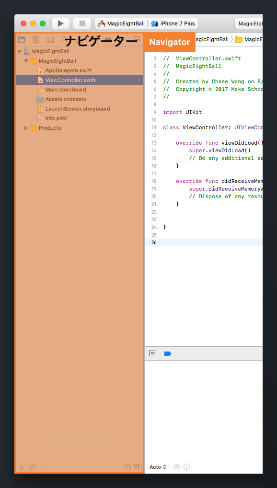

新しく作成した Xcode プロジェクトの周囲を見てみましょう。現在のXcodeプロジェクトのすべてのファイルと設定は、 _Single View App_ のテンプレートからプロジェクトが作成された時に、デフォルトとなる構成です。

プロジェクトの内容を見て、ファイルからファイルへとナビゲートするには、ナビゲーターを使用する必要があります。

# ナビゲーター

ナビゲーターのペインには、Xcodeの多くの様々なツールのための複数のタブが含まれています（ナビゲーターと呼ばれています）。

ナビゲーターペインの最上部にある別々のアイコンをクリックすると、タブを変更できます。

これらのナビゲータータブは、どれも便利なツールであり、使い方は後々学びます。その中でも特に重要なものは次の通りです：

- プロジェクトナビゲーター： ファイルをナビゲートし、変更する
- 検索ナビゲーター: ファイルを見つけるためにプロジェクト全体を検索する
- 問題ナビゲーター： プロジェクトの警告やエラーを見つけ、修復する

このチュートリアルでは、最初のタブであるプロジェクトナビゲーターだけに焦点を当てますが、他のものについてもいずれ学ぶことになります。

<!-- include issues navigator? -->

## プロジェクトナビゲーター

プロジェクトナビゲーターは、プロジェクトファイルをナビゲートし、整理するのに役に立ちます。つまり、同じプロジェクト内の様々なファイルを見つけて開くのがもっと簡単になるということです。

> [action]
ナビゲーターペインでは、必ずプロジェクトナビゲーターを有効にしてください。有効ではない場合は、最初のナビゲータータブをクリックしてください。フォルダのような外見のアイコンが付いています。

プロジェクトナビゲーターのタブがアクティブな状態だと、ナビゲーターのタブのすぐ下でプロジェクトのファイルを見つけられるはずです：

プロジェクトのさまざまなファイルをいくつか見てみましょう。

# Xcode プロジェクトファイル

> [action]
ナビゲーターでは、プロジェクトナビゲーターの最上部でXcodeプロジェクトファイルを選択してください。次のように表示されます。
>

<!-- break -->

> [info]
プロジェクトナビゲーターでファイルを選択すると、いつでもエディタエリアが対応するファイルと一緒に更新されることに気づくでしょう。さらに、ユーティリティエリアもまた、有効なファイルに関して利用できるオプションと一致するように変化します。お望みであれば、2つのファイルの間を行き来してテストしてみましょう。

プロジェクトの詳細では、アプリの設定を構成することができます。例えば、ユーザーのiPhoneホーム画面に表示されるアプリ名を変更するプロセスを進めてみましょう。

> [action]
何を変更しているのかについて理解を深めるために、iPhone 7シミュレーター上でアプリを実行します。先ほどと同じように空っぽで真っ白な画面が表示されます。
>
次にcommand-shift-hキーを押してください。これにより、iPhone 7シミュレーターのホーム画面に移動するはずです。
>

以上からわかるように、現在のアプリのアイコンは新しいプロジェクトに付いてくるデフォルトの空白のアプリアイコンです。また、プロジェクト名は、デフォルトで、プロジェクトを作成したときに設定した製品名になっています。いずれは両方とも変更しますが、まずは、アプリの _Display Name_ を変更しましょう。

Xcodeに戻って、プロジェクト詳細の _Display Name_ フィールドでアプリの表示名を変更できます。プロジェクトナビゲーターでXcodeプロジェクトファイルが有効になっていることを確認してください。

> [action]
アプリの表示名をデフォルトの`MagicEightBall`から`マジックエイトボール`に変更してください。
>

完了です！ 簡単でしたね。

アプリのアイコンを変更する前に、他のファイルの種類をいくつか見てみましょう。

# Swiftソースファイル

プロジェクトナビゲーターで、Xcodeプロジェクトファイルの下でネスト化された`AppDelegate.swift`という名前のファイルを選択してください。

`.swift`という拡張子の付いたファイルは、Swiftソースファイルです。あなたの書いたコードは、Swiftソースファイルの中にあります。

_App Delegate_ はアプリのライフサイクルの取り扱いに関して責任を負っている重要なオブジェクトです。該当するファイルに含まれるメソッドの名前のいくつかに注目すると、次のような名前に気づきます：

- `application(_:didFinishLaunchingWithOptions:)``
- `applicationWillResignActive(_:)`
- `applicationWillTerminate(_:)`

察しがつく通り、これらのメソッドはすべて、アプリがステートを変更した時に発生します。たとえば、アプリが初めて起動したとき、バックグラウンドに移ったとき、または終了したときなどです。このチュートリアルに関してはここでは何も追加しませんが、コードを追加して、重要なアプリライフサイクルのイベントが発生したときのアプリの動作をカスタマイズすることができます。

# アセットのカタログ

さて、アプリのアイコンの変更に戻りましょう。

> [action]
プロジェクトナビゲーターから、`Assets.xcassets`ファイルを選択してください。エディタエリアの中に、 _AppIcon_ という名前の単一アセットプレースホルダーがあります 。通常は、_Asset Catalog_ でアプリのアセットすべてのリストを閲覧します。
>
アセットカタログで、空の _AppIcon_ プレースホルダーアセットを選択してください。アプリアイコン用の空のプレースホルダーを複数の寸法及びデバイスにおいて沢山見るでしょう。
>

なぜこんなにたくさん空のアプリアイコンのプレースホルダーがあるのかと不思議に思うかもしれませんが、これは異なるデバイスの、様々な解像度やサイズに対応するためです。

マジックエイトボールアプリでは、ホーム画面に表示されるアプリのアイコン画像だけ追加します。本当にApp Storeにアプリを提出する場合は、関連するアプリのアイコンサイズすべてに対応する必要があります。

> [action]
マジックエイトボールアプリのアイコン画像をダウンロードしてください [こちらをクリックしてください](https://github.com/MakeSchool-Tutorials/Magic-8Ball-Swift4/raw/master/magic_app_icon.zip)。画像のアセットをダウンロードして解凍した後は、`app_icon@2x.png`を `iPhone App iOS 7-11 60pt` @2xの空のプレースホルダーにドラッグして、ドロップしてください。`app_icon@3x.png`についても同じ作業を繰り返してください。

作業が済むと、 _AppIcon_ の画像セットは次のように表示されるはずです：

マジックエイトボールアプリに、カスタムアプリアイコンを追加できました！

> [info]
マジックエイトボールアプリのアイコンを追加すると、新しい警告が表示されることに気づくでしょう。XcodeプロジェクトはApp StoreやiPadデバイス用のアプリアイコンの追加バージョンを予期しているため、これらが表示されます。このチュートリアルでは、これらの警告を無視して構いません。

# 変更をテストする

変更がうまく動作することを確認するため、アプリを実行してみましょう。アプリの動作は変更していないので、アプリを実行すると、真っ白で空っぽの画面が表示されることに注意しましょう。

> [action]
ツールバーのRunボタンを押すか、CMD-rショートカットでアプリを実行します。アプリがシミュレーターで有効になっている状態で、command-shift-hを押します。シミュレーターは新しいアプリアイコンと表示名でiPhoneのホーム画面に戻ります！
>

