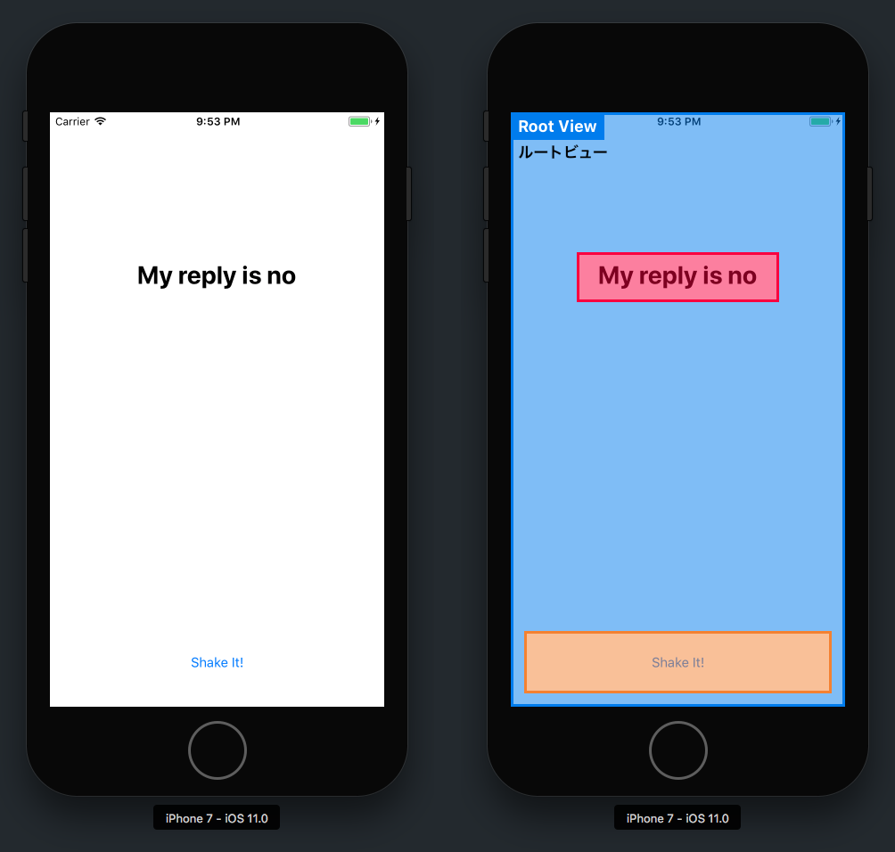
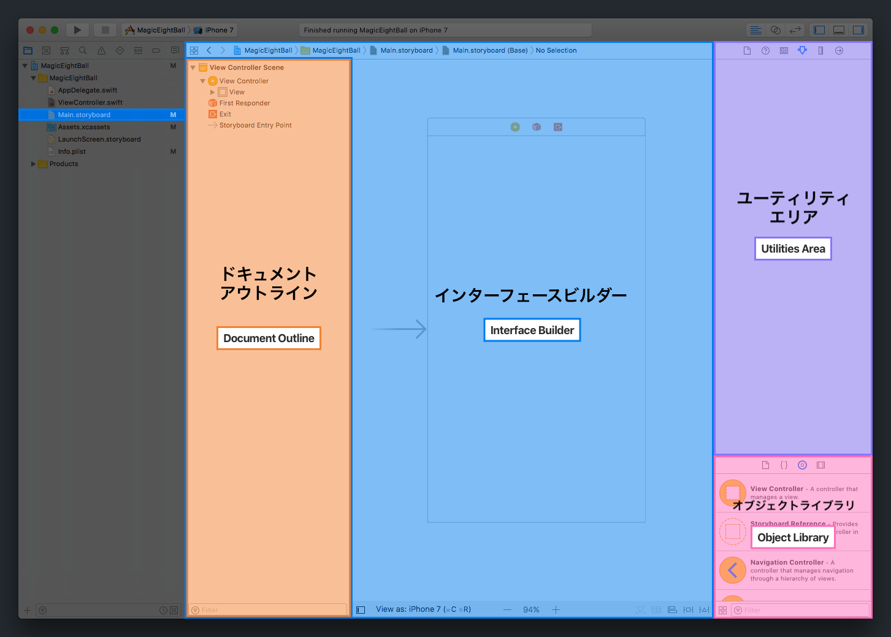
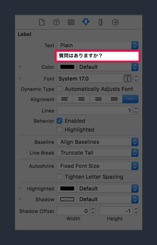
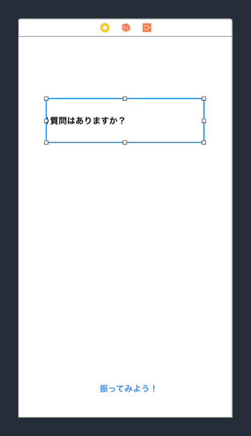
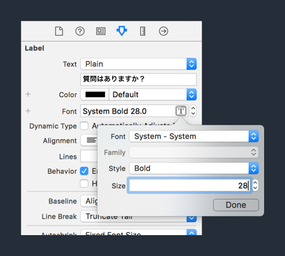
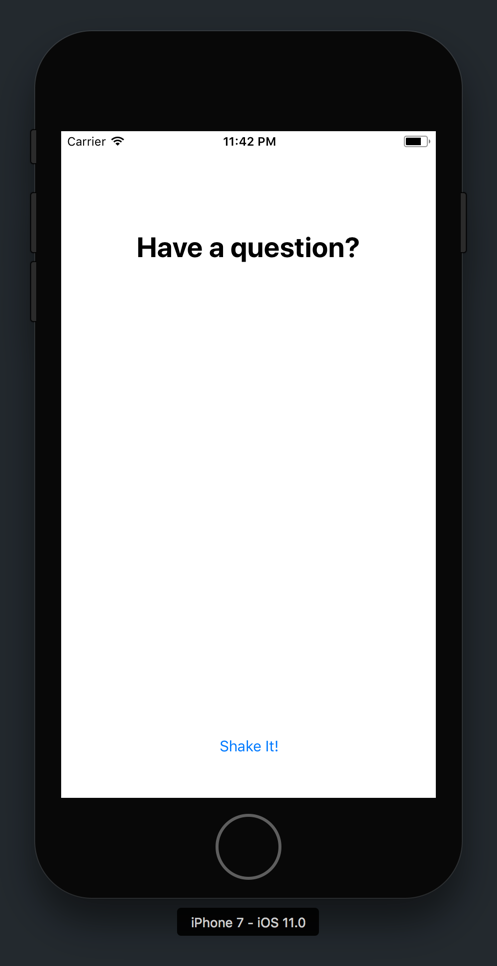

これまでは、アプリが実行されたときの動作の変更は何もしてきませんでした。シミュレーター上でアプリを実行するとわかるように、空っぽで、真っ白な画面のままです。

このセクションでは、マジックエイトボールのUIを構築します。

> [info]
**UIとは何か**
>
ユーザーインターフェースは一般的にUIと呼ばれており、あなたのアプリがユーザーに対してスクリーン上で表示する要素を指しています。これには、テキストや画像のような視覚的な要素だけではなく、ボタン、スライダー、タブのような双方向性の要素も含まれています。プログラミングでは、UIをビューとして参照するのが一般的です。

# ビューコントローラーの導入

iOSアプリを開発する計画があるなら、`UIViewController`について学習する必要があります。ビューコントローラーは、iOS開発における基本的な構成要素の一つです。

`UIViewController`は、一連のビューの管理に関する責任を負っているクラスです。各ビューコントローラーにはルートビューがあり、これが他のサブビューを配置するキャンバスの役割を果たします。

<!-- can consider adding jump to definition here for UIViewController view property -->

上から分かる通り、テキストラベルとボタンは両方とも、ビューコントローラーのルートビューの上に配置されるサブビューです。

初心者としては、アプリの各画面をビューコントローラーとして考えるといいでしょう、 ボタン、テキスト、画像はすべて、対応するビューコントローラーオブジェクトが管理をするサブビューです。ビューコントローラーは、ユーザーがボタンをタップした場合に何が発生するかに関して責任を負います。

> [info]
このチュートリアルでは単一のビューコントローラーしか使いませんが、アプリ内ではビューコントローラーをいくつも設定できます。

次に、すべての _Single View App_ のXcodeテンプレートに付いてくるデフォルトビューコントローラーで、UIを構築しましょう。

# ストーリーボードに UI の追加

まずはStoryboardファイルを開く必要があります。

> [action]
プロジェクトのナビゲーターで、`Main.storyboard`ファイルを選択してください。エディタエリアが次のように変化します：

ハイライトされている各エリアは、メインのStoryboardファイルでUIを構築するにあたって重要となります：

- Document Outline（オレンジ）： Storyboardファイルの階層を縦型表示します
- インターフェイスビルダー（青）： UIの外観を視覚的に表示します
- ユーティリティエリア（紫）： Storyboard要素のプロパティ、サイズ、その他の詳細を構成します
- Object Library（ピンク）： Storyboardで使用できる、Apple既成のUIコンポートすべてのリストを表示します

マジックエイトボールのシェークボタンをビューコントローラーに追加しましょう。

> [action]

>
_Object Library_ で`Button`オブジェクトを見つけ、ビューコントローラーのルートビューの上にこれをドラッグし、ドロップしてください。

次に、ボタンに正しいタイトルテキストを与えられるようにするため、ユーティリティエリアについてもっと学びましょう。

# ユーティリティエリア

ナビゲーターと同じく、ユーティリティのペインには、その上部にインスペクターと呼ばれる複数の異なるタブがあります。

タブは、何がアクティブに選択されているかというコンテクストに左右されます。これはつまり、ユーティリティエリアのタブは、あなたがXcodeで最後にクリックした内容に基づいて変化するという意味です。

各インスペクターによって、選択された項目に関する様々な詳細や属性を変更できるようになります。

## 属性インスペクター

まずは、選択されたStoryboardオブジェクトの属性を変更する、属性インスペクターを見てみましょう。これを使ってボタンのタイトルを変更できます。

> [action]
1. しっかりボタンをクリックして、アクティブに選択されていることを確認してください。ユーティリティのペインはコンテクストに依存するものであり、何が選択されたかによって変化するということを覚えておきましょう。
2. 次に、ユーティリティエリアの属性インスペクタータブに移動してください。左側から数えて4つ目のアイコンです。
3. 最後に、タイトルフィールドを見つけて、デフォルトテキストである`Button`から`Shake It!`に変更してください。

すると、`Shake It!`というタイトルが押し込まれたボタンが表示されるはずです。

次に、サイズインスペクターを使ってこれを修正します。

## サイズインスペクター

今のところ、シェークボタンの幅よりも新しいタイトルテキストの方が長いので、ボタンがきゅうくつな状態です。これを修正するには、ボタンのフレームを変更します。

オブジェクトのフレームは、オブジェクトのXおよびYの位置とそのサイズ（高さと幅）を参照しています。

サイズインスペクターでは、現在のスキップボタンのフレームを見ることができます。

> [action]
まず、ユーティリティエリアでサイズインスペクターに移動します。
>
ビューセクション以下で選択されたStoryboardオブジェクトの現在のフレームを閲覧し、編集できます。

ボタンのフレームを変更する方法として、もっとシンプルですが、正確性に欠けるのは、カーソルで選択してドラッグする方法です。オブジェクトの中心をドラッグして移動し、境界線の隅をドラッグしてサイズ変更することができます。

> [action]
スキップボタンのフレームを変更して中央に置き、インターフェースビルダーのビューコントローラー下部に沿って配置します。
>

完璧な配置である必要はありませんが、もっと正確にしたい場合は、サイズインスペクターを利用できます。

> [info]
このチュートリアルでは、各サブビューに関して、あらかじめ定義されたフレームを設定していきます。これはつまり、ユーザーが異なる画面サイズのシミュレーターまたはiPhoneを使用する場合、UIのサイズは不正確に設定されるという意味です。
>
今のところはこれでOKです。このチュートリアルはXcodeとiOS開発に慣れることに焦点を当てています。次のチップ計算機チュートリアルでは、Auto-layoutやスタックビューのようなツールを使って、ダイナミックにサイズが調整されるビューの作成方法を学びます。

# ラベルの追加

UIを完成させるには、マジックエイトボールの回答を表示するラベルも追加する必要があります。

> [action]
_Object Library_ からラベルを見つけ、ビューコントローラーのルートビューにドラッグしてください。
>

次に、ラベルのサイズと属性を変更します。

> [action]
1. ラベルを選択して、ユーティリティエリアで属性インスペクターを開いてください。
2. `Text`属性をデフォルトの`Text`というプレースホルダーから`質問はありますか？`に変更してください。これは、アプリが開かれるたびに表示されるデフォルトのテキストになります。
3. 新たなテキストに合わせてラベルのサイズを変更してください。
4. 属性インスペクターで、テキストのアライメントを _Center_ に変更してください。
5. 最後に、 _Font_ の属性を`System 17.0`から`System Bold 28.0`へと変更してください。

私たちのアプリのUI設定が完了しました。進捗状況を確認するため、ちょっとビルドして、実行してみましょう。

> [action]
iPhone 7のシミュレーター上でアプリをビルドし、実行します。次の内容が表示されます：
>

インターフェイスビルダーを使ってUIを広げました。次にビューとSwiftソースファイルをつなげる方法を学びましょう。ご想像の通り、Storyboardのオブジェクトをコードに接続しなければ、アプリにはあまりできることはありません。
